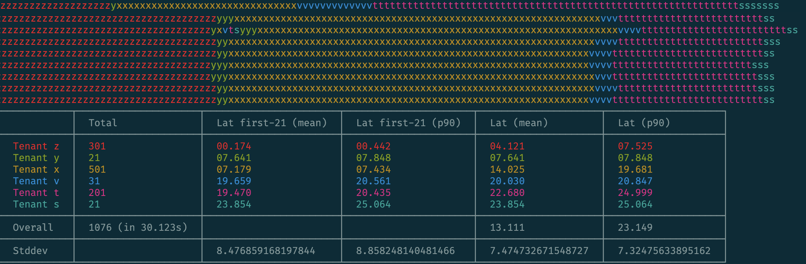

# FaQueue

This repo contains code to experiment with different background jobs _fairness_ strategies.

## About

The problem of _fair_ background jobs processing usually occurs in multi-tenant applications using shared queues to process tasks (e.g., using Sidekiq). Imagine you have an named queue to process some tasks, say, outgoing E-mail or SMS notifications. This single queue serves all the tenants, big and small. Whenever a large tenant triggers a massive notifications delivery (`User.find_each { UserMailer.notify_smth.deliver_later }`) and enqueues thousands of jobs. Delivering notifications takes some time (hundreds of milliseconds or even seconds), the jobs processor would be _occupied_ by this tenant; others would experience noticable delays.

There are multiple ways to mitigate this problem and we research them in this repo.

Since this is a pure academical research, we avoid using any specific _executor_. Instead, we use Ruby 3 Ractors for concurrent jobs execution.
However, we assume that a background job executor has a fixed predefined set of queues (like Sidekiq); thus, we cannot use a queue-per-tenant approach, we need to introduce the fairness at the client-side.

## The method

We perform the following experiment for each strategy.

Given N numbers each representing the number of jobs to enqueue per tenant, we enqueue N background jobs (_bulk jobs_).
Each bulk jobs enqueues N[i] jobs.

Then we wait for all jobs to complete.

We measure the latency for each executed job and calculate the following statistical data:

- Mean and p90 latency per tenant.
- Mean and p90 latency of the first K jobs (_head_) per tenant, where K = min(N[i]).
- Standard deviation for the calculated means and percentiles.

The most important metrics is a standard deviation of the _heads_ means/percentiles. Why so? We're interested in minimizing delays caused by large tenants. In other words, we want jobs from all tenants to be executed at the same _speed_. On the other hand, it's OK for latency to grow if we enqueue thousands of jobs, but that should not affect those who enqueue dozens.

## Usage

Run a specific strategy emulation like this:

```sh
ruby baseline.rb -c 16 -n 300,20,500,200,1000,120
```

You will see a visualization of executed jobs (each color represents a particular tenant) and the final statistics information (see below).

To learn about available CLI options use `-h` switch:

```sh
$ ruby baseline.rb -h
Baseline: just a queue, totally unfair
    -n, --number=SCALES              The total number of jobs to enqueue per tenant (comma-separated)
    -c, --concurrency=CONCURRENCY    The concurrency factor (depends on implementation)
```

## Strategies

### Baseline

This is the default behavior: do not care about the fairness.

<p align="center">
    
</p>

### Random shards

This strategy is described [here][sidekiq-shards].

## Resources

- [The State of Background Jobs in 2019][kirs-post] by Kir Shatrov
- [Fairway][]

[kirs-post]: https://kirshatrov.com/2019/01/03/state-of-background-jobs/
[Fairway]: https://github.com/customerio/fairway
[sidekiq-shards]: https://www.mikeperham.com/2019/12/17/workload-isolation-with-queue-sharding/